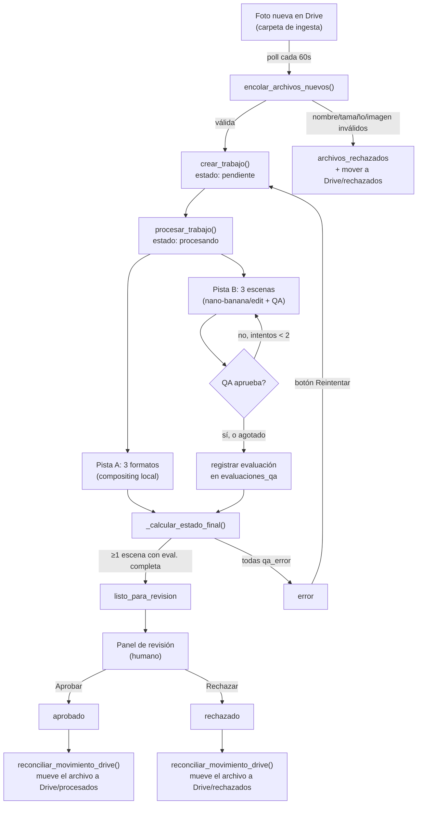

# Gorrolandia — cómo funciona y cómo se trabaja con esto

Documento de referencia operativa. Explica el flujo completo del pipeline,
el modelo de datos, la estructura del proyecto, y cómo operarlo día a día.
No repite el detalle ronda por ronda de *por qué* cada decisión de diseño
se tomó así — ese plan (revisado 4 veces con Codex antes de implementarse)
ya cumplió su función y no se conserva como archivo aparte; el resumen de
sus conclusiones vive en la sección 11 de este documento, y el detalle
completo sigue disponible en el historial de git si alguna vez hace falta.

Última actualización: 2026-09-11.

---

## 1. Qué es esto

Gorrolandia automatiza la generación de imágenes de marketing para una
tienda de gorras. Un operador sube una foto de producto a una carpeta de
Google Drive; el sistema la recoge sola, genera automáticamente:

- **3 formatos de catálogo** (recorte + fondo + sombra, sin IA — Pista A)
- **3 escenas de "modelo usando la gorra"** (edición por IA sobre fotos de
  personas reales — Pista B), cada una evaluada por un control de calidad
  automático y reintentada si falla

Un humano revisa el resultado en un panel web y aprueba o rechaza cada
trabajo antes de publicarlo.

---

## 2. Arquitectura: las dos pistas

| | Pista A (`fase5_pista_a_produccion.py`) | Pista B (`fase6_qa_reintento.py` + `fase8_worker_ingesta.py`) |
|---|---|---|
| Qué produce | 3 imágenes de catálogo (4x5, 1x1, 9x16) | 3 imágenes de "modelo usando la gorra" (una por escena) |
| Cómo | Compositing local determinista: quita el fondo (`rembg`), pega sobre un fondo degradado con sombra | Edición por IA: `fal-ai/nano-banana/edit` reemplaza la gorra que lleva puesta una persona en una foto real por la del producto |
| Costo | $0.00 (sin llamadas a APIs externas) | ~$0.06 por intento de generación + ~$0.02 por evaluación de QA |
| Determinismo | Sí — mismo input, mismo output byte a byte | No — cada llamada al modelo de IA puede variar; por eso existe el QA + reintento |

---

## 3. Flujo completo, de punta a punta



### 3.1 Ingesta (`encolar_archivos_nuevos`, dentro de `fase8_worker_ingesta.py`)

Cada ciclo (cada 60s mientras el worker corre):

1. Lista archivos en la carpeta de Drive de ingesta (pagina el listado
   completo, no solo la primera página).
2. Para cada archivo nuevo (por `drive_file_id`, nunca reprocesa uno ya
   visto): valida el tamaño (≤20MB), deriva el SKU del nombre de archivo
   (rechaza nombres reservados de Windows, vacíos, con puntos raros),
   descarga con límite real de bytes, valida que decodifique como imagen y
   que sus dimensiones no sean absurdas.
3. Si algo falla: se registra en `archivos_rechazados` (dedup durable, no
   se reintenta el mismo archivo eternamente) y se mueve a la subcarpeta
   `rechazados` en Drive.
4. Si todo pasa: se crea una fila en `trabajos` con estado `pendiente`.

### 3.2 Procesamiento (`procesar_trabajo`)

Por cada trabajo `pendiente`:

- **Pista A**: genera solo los formatos que faltan o están corruptos (nunca
  regenera uno ya válido). Guarda en
  `output/fase8/trabajos/<trabajo_id>/pista_a/<sku>/`.
- **Pista B**: por cada una de las 3 escenas de producción (`04`, `09`,
  `29`, definidas en `ESCENAS_PRODUCCION` en `src/prompts.py`):
  - Si la escena ya tiene una evaluación vigente completa y aprobada → se
    salta, no gasta nada.
  - Si tiene imagen válida pero la evaluación falló (`qa_error`) → **solo
    reintenta el QA**, no genera una imagen nueva (no tiene sentido pagar
    por generar de nuevo algo que nunca se llegó a evaluar bien).
  - Si el QA evaluó y no aprobó → genera un intento nuevo, con el prompt
    corregido dirigido específicamente a los items que fallaron (color,
    logo, parche, ángulo, etc. — ver `CORRECCIONES` en
    `fase6_qa_reintento.py`).
  - Máximo 2 intentos por escena. Si se agotan sin aprobar, la escena
    queda marcada para revisión manual — el sistema no vuelve a intentar
    solo.

Al terminar, se recalcula el estado del trabajo: **`listo_para_revision`
si al menos una escena de Pista B tiene una evaluación completa** (no
necesariamente aprobada — un humano puede revisar y decidir); **`error`
solo si las 3 escenas terminaron en `qa_error`**.

### 3.3 Control de calidad (`evaluar_calidad`, en `fase6_qa_reintento.py`)

Le muestra a un modelo de visión (`google/gemini-2.5-flash` vía
`openrouter/router/vision`) **3 imágenes**: el producto real, la escena
original (antes de editar), y el resultado generado. Evalúa 8 criterios
binarios (color, logo, parche, rostro/escena preservados, ángulo,
iluminación, estructura) — ninguno asume un color o marca fija, todos
comparan contra la imagen 1 real. Si algún item crítico falla, el score
queda limitado a menos de 80 y no se aprueba.

La respuesta del modelo se parsea con tolerancia a que venga envuelta en
una cerca de markdown (`` ```json ... ``` ``, que el modelo agrega pese a
que el prompt pide no hacerlo), pero rechaza cualquier otra cosa que no
sea exactamente el JSON esperado — nunca interpreta un valor ambiguo como
`false` en silencio.

### 3.4 Reconciliación (3 pasadas extra en cada ciclo del worker)

Además de procesar trabajos `pendiente`, cada ciclo también:

1. **Resetea huérfanos** (`procesando` → `pendiente`) al arrancar — evidencia
   de un corte anterior, nunca de otro worker corriendo en paralelo (hay un
   lock real de sistema operativo que lo impide).
2. **Reintenta QA incompleto** en trabajos `listo_para_revision` (nunca en
   `rechazado` ni `aprobado` — un trabajo ya aprobado no debe volver a
   moverse solo porque se actualizó `VERSION_QA`).
3. **Mueve archivos en Drive** según el estado del trabajo
   (`listo_para_revision`/`aprobado` → carpeta `procesados`, `rechazado` →
   carpeta `rechazados`) — siempre verificando la ubicación **real** en
   Drive antes de mover, nunca confiando en una caché local.

---

## 4. Modelo de datos (`output/gorrolandia.db`, SQLite)

```
trabajos                    generaciones                  evaluaciones_qa
─────────                   ────────────                  ───────────────
id                    ┌──── id                       ┌──── id
sku                   │     trabajo_id ───────────────┘     generacion_id ─┘
estado                │     modelo_ia  ('compositing_local' | 'nano_banana')
drive_file_id         │     escena_id  (formato para Pista A, '04'/'09'/'29' para Pista B)
drive_carpeta ────────┘     intento
ruta_local_foto              ruta_output
error                        costo_usd
```

- **`trabajos`**: una fila por foto ingresada. `estado` es el motor de todo
  el flujo (`pendiente` → `procesando` → `listo_para_revision` →
  `aprobado`/`rechazado`, o `error`). `drive_carpeta` es una **caché**
  (nunca la fuente de verdad) de en qué carpeta de Drive está el archivo
  ahora — la reconciliación siempre verifica contra la API real antes de
  decidir mover algo.
- **`generaciones`**: cada llamada de generación (Pista A o Pista B). El
  índice único `(trabajo_id, modelo_ia, escena_id, intento)` hace
  imposible duplicar una fila por bug de lógica.
- **`evaluaciones_qa`**: cada evaluación de calidad, versionada por
  `VERSION_QA` (constante en `src/prompts.py`). **Solo la más reciente
  para la versión actual cuenta** (`db.ultima_evaluacion_vigente()`) — si
  el prompt de QA cambia, todo lo evaluado con la versión vieja deja de
  contar automáticamente, sin tocar ninguna fila histórica.
- **`archivos_rechazados`**: dedup durable de archivos de Drive que
  fallaron validación, para no re-descargarlos ni re-rechazarlos en cada
  ciclo.

### Conceptos clave para leer el código

- **"Evaluación vigente"**: la fila de `evaluaciones_qa` con el `id` más
  alto para `(generacion_id, VERSION_QA)`. Nunca "alguna evaluación dice
  X" — siempre la más reciente.
- **Un humano puede aprobar aunque el QA haya dicho que no aprueba.** Lo
  único que bloquea el botón "Aprobar" es que la evaluación esté
  **incompleta** (`qa_error` o ausente) — nunca que el score sea bajo. Ese
  es el sentido del panel: dar la última palabra a una persona.
- **`ESCENAS_PRODUCCION = ["04", "09", "29"]`** (en `src/prompts.py`): el
  subconjunto fijo de escenas del banco de 33 que se usa en producción
  para no generar las 33 por cada SKU.

---

## 5. Estructura del proyecto

```
publicidad/
├── src/
│   ├── db.py                       # capa de datos + transiciones de estado (CAS)
│   ├── prompts.py                  # PROMPT_V3, VERSION_QA, ESCENAS_PRODUCCION
│   ├── seguridad.py                # redacción de secretos en logs/DB/panel
│   ├── fase5_pista_a_produccion.py # Pista A
│   ├── fase6_qa_reintento.py       # QA + reintento dirigido
│   ├── fase8_worker_ingesta.py     # worker de producción (Drive → trabajos)
│   ├── fase8_drive_cliente.py      # cliente de Google Drive
│   ├── fase8_panel_revision.py     # panel Streamlit
│   ├── fase8_backfill_historico.py # migración de una sola vez (ya ejecutada)
│   ├── fase8_backup_db.py          # backup + poda de backups viejos
│   └── fase{1,2,3,4}_*.py          # scripts históricos de fases ya cerradas
├── tests/                          # pytest, 79 pruebas, BD temporal aislada
├── scripts/                        # wrappers .ps1/.bat + registro de Tareas Programadas
├── docs/                           # este archivo + planes + briefs de fases
├── assets/
│   ├── skus_pendientes/            # fotos de producto descargadas de Drive (no versionado)
│   ├── escenas_base/               # banco de 33 escenas original
│   └── escenas_base_mejoradas/     # mismo banco, upscaled (el que usa Pista B)
├── output/
│   ├── gorrolandia.db              # la base de datos real
│   ├── fase8/trabajos/<id>/        # imágenes generadas por trabajo
│   ├── backups/                    # respaldos de la DB (diarios + manuales)
│   ├── logs/                       # logs del worker y del backup diario
│   └── fase2.../fase7/             # salidas históricas de fases cerradas
└── .streamlit/config.toml          # fuerza el panel a 127.0.0.1 únicamente
```

---

## 6. Cómo se opera esto, día a día

### 6.1 El worker — corre solo

Se registró como **Tarea Programada de Windows** (`Gorrolandia-Worker`):
arranca automáticamente 1 minuto después de que inicias sesión en Windows,
y se queda corriendo indefinidamente en segundo plano (revisa Drive cada
60 segundos). Si el proceso muere, Windows lo reintenta hasta 3 veces.

**No necesitas hacer nada para que corra** — solo inicia sesión en tu
máquina normalmente. Para confirmar que está vivo:

```powershell
Get-Content "output\logs\worker.log" -Tail 20
```

Si necesitas arrancarlo a mano (por ejemplo, para verlo en tu propia
terminal en vez del log):

```bash
cd src
python fase8_worker_ingesta.py           # loop continuo
python fase8_worker_ingesta.py --once    # un solo ciclo, útil para depurar
```

### 6.2 El panel de revisión — donde apruebas/rechazas

```bash
streamlit run src/fase8_panel_revision.py
```

Abre en `http://127.0.0.1:8501` (forzado a localhost, nunca accesible
desde la red). Muestra cada trabajo `listo_para_revision` con sus 6
imágenes (3 de Pista A + 3 de Pista B), score y comentario del QA por
escena, y botones **Aprobar** / **Rechazar** — o **Reintentar** para
trabajos en `error`. Cada clic es una transición segura (nunca pisa una
decisión tomada en otra pestaña al mismo tiempo).

### 6.3 Backups — automáticos, diarios

Tarea Programada `Gorrolandia-BackupDiario`: todos los días a las 3:00 AM
corre `src/fase8_backup_db.py`, que respalda `gorrolandia.db` de forma
segura (API de backup de SQLite, no una copia cruda de archivo) a
`output/backups/`, y borra los que tengan más de 30 días. Para correrlo a
mano:

```bash
cd src
python fase8_backup_db.py
```

### 6.4 Migración/backfill histórico

`fase8_backfill_historico.py` ya se corrió una vez (10 sept 2026) para
adaptar los datos de las Fases 2-7 al esquema nuevo. **No debería
necesitar correrse de nuevo** — es un script de una sola vez, con sus
propios pasos de confirmación interactiva y backup automático antes de
tocar nada, por si alguna vez hace falta.

---

## 7. Comandos de referencia rápida

| Qué quiero hacer | Comando |
|---|---|
| Ver si el worker está vivo | `Get-Content output\logs\worker.log -Tail 20` |
| Arrancar el worker a mano | `cd src && python fase8_worker_ingesta.py` |
| Abrir el panel | `streamlit run src/fase8_panel_revision.py` |
| Correr las pruebas | `python -m pytest tests/ -q` |
| Backup manual de la DB | `cd src && python fase8_backup_db.py` |
| Ver trabajos por estado (SQL directo) | `sqlite3 output/gorrolandia.db "SELECT sku, estado FROM trabajos"` |
| Re-registrar las Tareas Programadas | `powershell -File scripts\registrar_tareas.ps1` |
| Ver logs del backup diario | `Get-Content output\logs\backup.log -Tail 20` |

---

## 8. Costos y trazabilidad

Todo costo real queda registrado en la base de datos:

- `generaciones.costo_usd` — $0.00 para Pista A, ~$0.06 por intento de
  Pista B (`fal-ai/nano-banana/edit`).
- `evaluaciones_qa.costo_usd` — ~$0.02 por evaluación (constante
  `COSTO_QA_USD` en `fase6_qa_reintento.py`; es un estimado documentado,
  no viene de una API de facturación real de fal.ai).

```sql
-- costo total histórico
SELECT ROUND(SUM(costo_usd), 2) FROM generaciones;
SELECT ROUND(SUM(costo_usd), 2) FROM evaluaciones_qa;
```

`src/fase7_consultas.py` tiene consultas agregadas más elaboradas (costo
por SKU, tasa de reintento, escena con peor tasa de aprobación) — es un
reporte histórico de la Fase 7, sigue funcionando igual contra los datos
reales.

---

## 9. Seguridad y credenciales

- `.env` (nunca versionado): `FAL_KEY`, `GOOGLE_SERVICE_ACCOUNT_FILE`,
  `GOOGLE_DRIVE_FOLDER_ID`.
- `credentials/service-account.json` (nunca versionado): la clave de la
  cuenta de servicio de Google. **Ya se rotó una vez** (10 sept 2026,
  después de que la clave anterior se expusiera accidentalmente en una
  conversación) — la vieja está confirmada eliminada en Cloud Console.
- Cualquier valor que parezca un secreto (headers `Authorization`, URLs
  con tokens, strings largos junto a `key`/`token`/`secret`/`password`) se
  redacta automáticamente antes de guardarse en la base de datos, mostrarse
  en el panel, o imprimirse en consola/logs (`src/seguridad.py`).
- El panel solo escucha en `127.0.0.1` (forzado por
  `.streamlit/config.toml`), nunca en la red.

**Si vuelves a rotar la clave de servicio**: descarga el JSON nuevo desde
Cloud Console, guárdalo como `credentials/service-account.json`
(reemplazando el archivo — mismo nombre siempre, así `.env` no necesita
cambiar), y borra la clave vieja en Cloud Console.

---

## 10. Pruebas automatizadas

```bash
python -m pytest tests/ -q
```

79 pruebas, corren en segundos, **nunca tocan `fal.ai` ni Drive real** ni
la base de datos de producción — cada una usa una base SQLite temporal
inyectada vía `GORROLANDIA_DB_PATH`, y mockean los clientes externos.
Cubren: migraciones de esquema (desde cero y desde el esquema real
preexistente), las transiciones de estado con compare-and-swap, el
parseo/validación estricta del QA (incluyendo la regresión del bug de
markdown), los guards de reanudación de Pista A/B, la relocalización de
archivos en Drive (incluyendo recuperación tras un crash a medio camino),
y el lock de instancia única del worker con subprocesos reales.

---

## 11. Por qué el sistema es como es (resumen — el plan de corrección completo, con las 20 rondas de revisión que llevó, vive en el historial de git, no como archivo aparte)

Este pipeline pasó por una corrección seria en septiembre de 2026. El
problema original: `PROMPT_V3` tenía **el color hardcodeado** ("la copa
debe quedar BLANCA, la visera NEGRA") sin importar el color real del
producto, y el clasificador de QA tenía el mismo sesgo — así que cualquier
SKU que no fuera blanco/negro salía mal y el sistema de todos modos lo
aprobaba. Se confirmó con imágenes reales (`TEST-SKU-004`, una gorra
verde) antes de tocar nada.

La corrección se revisó 4 veces de forma independiente con Codex (20
rondas en total) antes de implementarse, y se confirmó en vivo después:
generar `TEST-SKU-004` de nuevo con el prompt corregido produjo el color
correcto (verde, no blanco/negro).

Otros bugs reales corregidos en el mismo esfuerzo: QA sin foto de escena
de referencia (no podía verificar si se preservaba el rostro/fondo), un
bug de *truthiness* de Python (`bool("false") == True`), reintento con
instrucciones contradictorias, un `UPDATE` incondicional en "Reintentar"
que contradecía las reglas del propio panel, y un parseo de JSON
demasiado estricto que rechazaba respuestas válidas solo porque venían
envueltas en una cerca de markdown (encontrado durante el backfill real,
causó 15 falsos `qa_error` de 39).

---

## 12. Limitaciones conocidas (decisiones deliberadas, no descuidos)

- **Un solo worker a la vez** — el lock de instancia única existe para
  eso. No está pensado para escalar a múltiples workers en paralelo; no
  hace falta para el volumen actual.
- **Sin monitoreo/alertas** — si el worker se cae y las 3 reintentos
  automáticos de Windows fallan, nadie se entera hasta que alguien nota
  que no hay trabajos nuevos. Proporcional para un operador único; no vale
  la pena un sistema de alertas para este volumen.
- **`fase6_validacion_clasificador.py` y `fase7_poblar_registro.py` están
  retirados** (`sys.exit` explicativo) — dependían de datos/firma
  antiguos que ya no aplican. `fase7_consultas.py` sigue activo (reporte
  histórico, datos correctos).
- **Sin defensa completa contra "decompression bombs"** — solo un chequeo
  barato de dimensiones sospechosas. Aceptado como riesgo bajo para una
  carpeta de Drive privada de un solo operador.
- **`output/fase8/pista_a` y `pista_b` de los 10 trabajos históricos**
  siguen con rutas por SKU (sin `trabajo_id` en la ruta) — los trabajos
  *nuevos* que cree el worker sí usan la ruta nueva
  (`output/fase8/trabajos/<id>/...`). No se migró lo histórico porque no
  hay colisión real con solo 10 SKUs únicos.

---

## 13. Si algo sale mal

| Síntoma | Qué revisar |
|---|---|
| El panel no muestra nada nuevo | ¿Está el worker corriendo? `Get-Content output\logs\worker.log -Tail 20` |
| Un trabajo lleva mucho tiempo en `pendiente` | ¿El worker de verdad está corriendo? ¿Hay un lock trabado? (`output/fase8/worker.lock` — se libera solo si el proceso murió) |
| Una escena específica no mejora aunque reintente | Puede estar **agotada** (2 intentos sin aprobar, o 6 evaluaciones de QA en `qa_error`) — el sistema no reintenta más solo, hace falta intervención manual (ver `TEST-SKU-004` como caso real ya resuelto) |
| `aprobar_trabajo()` devuelve `artefacto_invalido` | Un archivo de ese trabajo se perdió o corrompió después de quedar listo para revisión — requiere reparación manual, el trabajo se queda visible hasta resolverlo |
| Necesito restaurar un backup | Detener worker y panel, reemplazar `output/gorrolandia.db` por el archivo en `output/backups/` que quieras, reiniciar |
